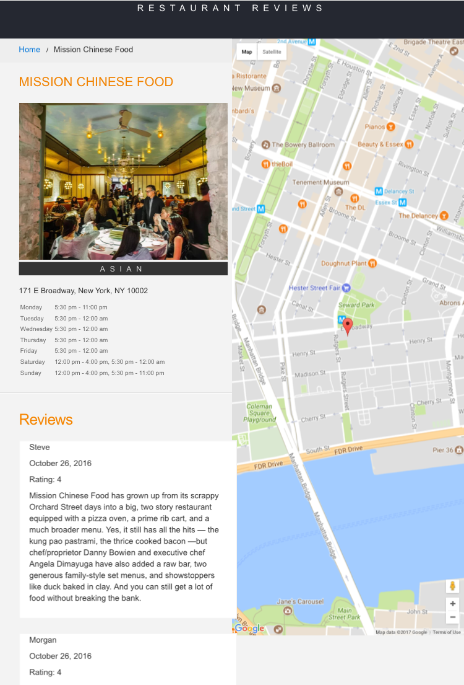
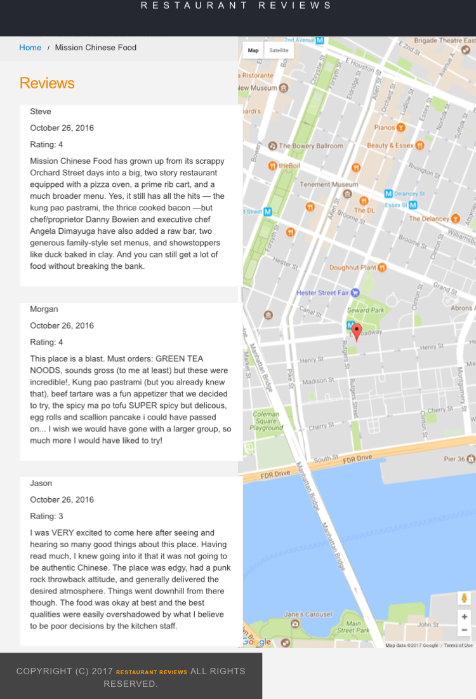
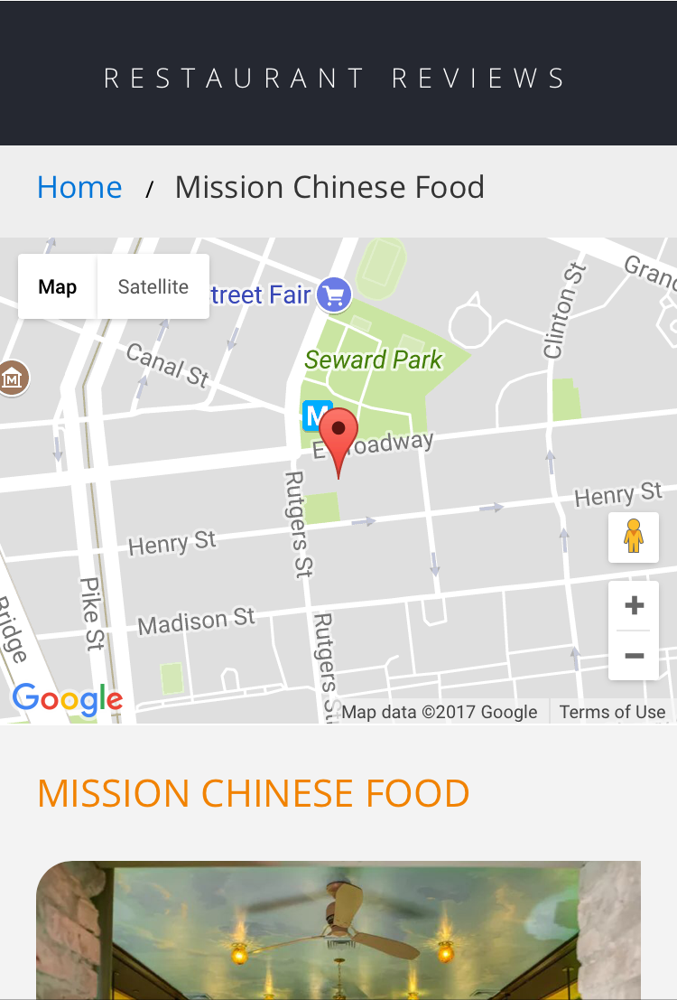
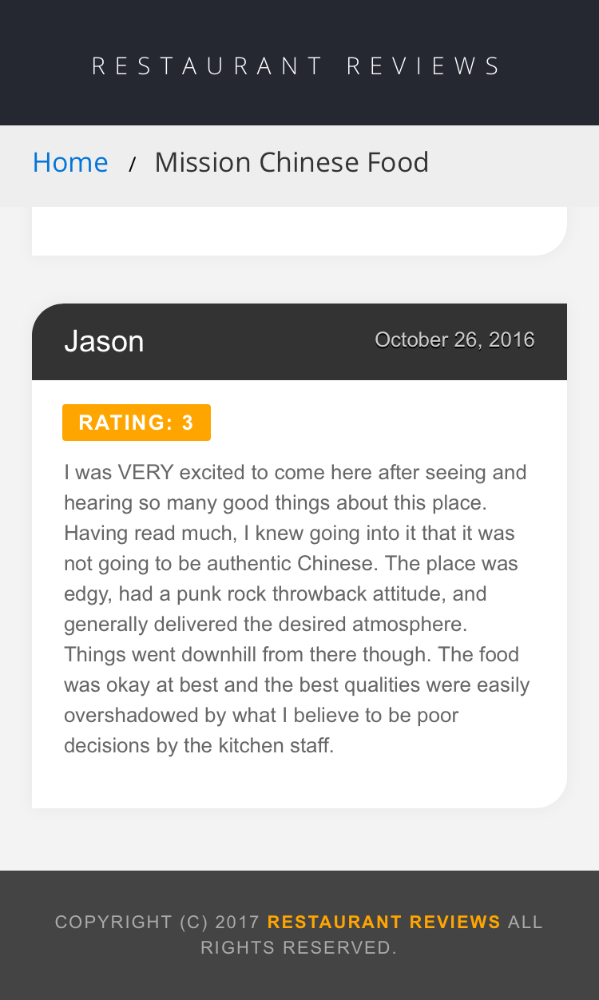

# Mobile Web Specialist Certification Course
---
#### _Three Stage Course Material Project - Restaurant Reviews_

## Project Overview: Stage 1

For the **Restaurant Reviews** projects, you will incrementally convert a static webpage to a **mobile-ready web application**. In **Stage One**, you will take a static design that lacks accessibility and convert the design to be responsive on different sized displays and accessible for screen reader use. You will also add a service worker to begin the process of creating a seamless offline experience for your users.

### Specification

You have been provided the code for a restaurant reviews website. The code has a lot of issues. It’s barely usable on a desktop browser, much less a mobile device. It also doesn’t include any standard accessibility features, and it doesn’t work offline at all. Your job is to update the code to resolve these issues while still maintaining the included functionality.

### Requirements

Make the provided site fully responsive. All of the page elements should be usable and visible in any viewport, including desktop, tablet, and mobile displays. Images shouldn't overlap, and page elements should wrap when the viewport is too small to display them side by side.

You will convert a site that looks like this:

  

---

  

into a site that looks like this:

  

---

  

---

**Make the site accessible**. Using what you've learned about web accessibility, ensure that alt attributes are present and descriptive for images. Add screen-reader-only attributes when appropriate to add useful supplementary text. Use semantic markup where possible, and aria attributes when semantic markup is not feasible.

**Cache the static site for offline use**. Using Cache API and a ServiceWorker, cache the data for the website so that any page (including images) that has been visited is accessible offline.

### What do you need to run the Application?

After download the repo, you need to run `npm install` to install the dependencies needed.

After that, you need to have a simple HTTP server to serve up the site files on your local computer. If you have Python installed on your machine (check with `python -V`), you can run: 

- For python 2.x: `python -m SimpleHTTPServer 8000` (or with other port)
- For python 3.x: `python3 -m http.server 8000` (or with other port)

Or you can run other server of your preference. I usually work with npm packages, for that I use **http-server** node package. Easy to install with: `npm install http-server -g`. To run, inside the project directory, if you don't need more options: `http-server -p 8000`
See the different options at: [http-server](https://www.npmjs.com/package/http-server).

With your server running, visit the site: `http://localhost:8000`.

## *Thanks for visiting this repo! I hope you enjoy* :D

